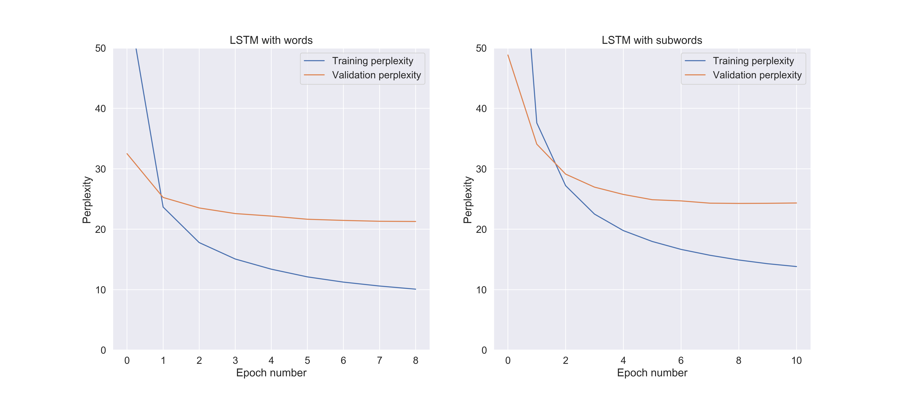
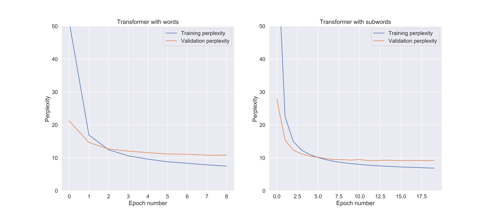

# Что было сделано
## 1. Препроцесиснг данных
В данных можно заметить следующие закономерности:
1. Большое количество сокращений (например, слово "женщина" часто сокращается до "жен" или даже "ж"). Также присутствуют довольно оригинальные сокращения, например, "с/о" означает "серьезные отношения"
2. В них присутствует доля орфоргафических ошибок ("ищю" или "симпотичный")
3. Большое количество чисел (как правило, они означают возраст либо номер телефона)

В связи с этим было принято следующее решение: числовые данные заменить на подстроки `'age'` и `'phone'` соответственно, а все сокращения по возможности дополнить до полных форм слова. Также, помимо этого, были проделаны стандартные процедуры: приведение к lowercase и удаление всех ненужных символов.

## 2. Обучение модели
Было использовано два варианта модели — LSTM и MultiHeadSelfAttention.

### 2.1. LSTM
LSTM показал себя на таком датасете не лучшим образом. Модель достаточно быстро переставала обучаться (примерно через 9-10 эпох) 
и значение perplexity оставалось большим. Ниже представлены графики зависимости train perplexity и validation perplexity от номера эпохи для двух моделей:
первая — LSTM, обученный на словах из датасета, второй — LSTM, обученный на sub-words, полученных с помощью `youtokentome.BPE`:

 
 ### 2.2. MultiHeadSelfAttention (Transformer)
 MultiHeadSelfAttention показал себя в целом лучше, что может объясняться тем, 
 что эта модель сложнее LSTM и поэтому лучше улавливает зависимости. Ниже представлены графики зависимости train perplexity и validation perplexity от номера эпохи для двух моделей:
первая — LSTM, обученный на словах из датасета, второй — LSTM, обученный на sub-words:

Так же на графиках видно, что sub-words показывает лучшие результаты, чем простое обучение на словах.
Это может быть связано как с тем, что использование более умных токенайзеров в целом более предпочтительно, так и с тем, что
в нашем датасете достаточно много сокращений, различных форм одного и того же слова и ошибок.

## Выводы:
Наилучший результат среди использованных моделей показал MultiHeadSelfAttention, обученный на sub-words
(`training_perplexity=6.8767, validation_perplexity= 9.2411`). Тем не менее, получившееся значение перплексии (а значит и loss) достаточно большое.
В дальнейшем можно улучшить данный результат, используя более сложные модели (к примеру, Stacked Transformer), а также улучшить препроцессинг данных.